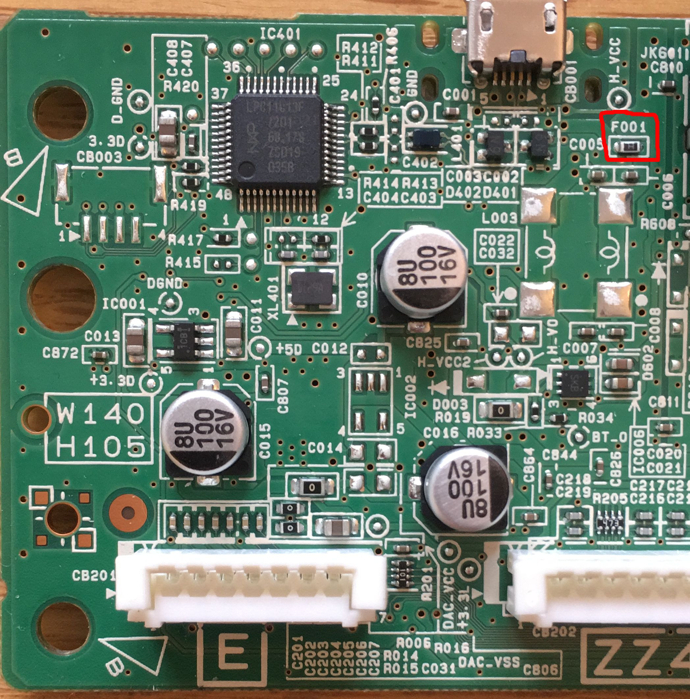

We got a Yamaha PSS-A50 for our kiddo. He loves banging away on it, I love that it's an order of magnitude cheaper than my OP-1.

The next day it wouldn't turn on. I took it apart to see if there were any obvious burn marks (or baby drool), but everything looked clean. After giving it a quick once-over themselves, the staff at The Starving Musician in Berkeley exchanged it for another.

It's been a few months, and now the replacement won't turn on either. [Apparently this is a common problem](https://www.reddit.com/r/synthesizers/comments/kjzwj5/my_yamaha_pss_a50_wont_turn_on/). Luckily, the board's components are extensively labeled and [Stephen Griffiths already found the board's fuse](https://stegriff.co.uk/upblog/fixing-a-yamaha-pss-a50-that-wont-switch-on/) (photo his, see top right):

<small>Photo credit: [Stephen Griffiths](https://stegriff.co.uk/upblog/fixing-a-yamaha-pss-a50-that-wont-switch-on/)</small>

Like Stephen, our keyboard's F001 also failed continuity. We hooked the battery wires to a benchtop power supply, bridged the fuse with some hookup wire, and tried the power button. After raising the current limit to 200mA or so, we got lights and sounds!

For the curious, the keyboard normally draws 100mA±20 (at 6VDC). We tried holding down various combinations of keys and buttons but other than initial power-on rush we never saw more than ~120mA so we have no idea what blew the fuse in the first place. Worse, [Jesse](https://fsck.com) found the part (it's a [1206L110TH](Littelfuse_PTC_1206L_Datasheet.pdf.pdf)) and it's supposed to be self-resetting with a trip current of 1.1A. Did Yamaha get a faulty batch? Is the circuit prone to odd shorts?

Anyway if you're still reading this, I assume you're angling to fix your own keyboard. Be aware the pads under the fuse are _tiny_ and spaced too far apart for a solder bridge. You're probably better off using your multimeter's continuity function to find a more convenient pad or via on the "safe" side of the fuse and bodging a fresh 1A fuse of your own between that and the positive battery lead (which is through-hole). Remember: *fuses are important safety components!*

Naturally, I bridged the fuse's pads with some 40ga magnet wire I had lying around; fingers crossed that all the smoke stays in. Or that the bodge fails first. I guess we'll see?

Good luck!
